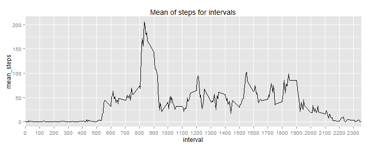

Reproducible Research: Peer Assessment 1
========================================================
output: 
html_document:
keep_md: true

Notice
------
I am not an english native speaker. A great effort was made to state clearly the ideas but I am not sure if it was accomplished. I apologize for the inconvenience and thanks for your patience.

## Loading and preprocessing the data
After calling the requested libraries, we check if there is a directory named "data" under the working directory to store the download. If not, it will be created and setted as working directory. Then it downloads and unzips the file. A data frame is created and populated with the content of the file and some initial inspections are done.


```r
library(dplyr)
```

```
## Warning: package 'dplyr' was built under R version 3.1.2
```

```
## 
## Attaching package: 'dplyr'
## 
## The following object is masked from 'package:stats':
## 
##     filter
## 
## The following objects are masked from 'package:base':
## 
##     intersect, setdiff, setequal, union
```

```r
library(ggplot2)
```

```
## Warning: package 'ggplot2' was built under R version 3.1.2
```

```r
if (!file.exists("data")){
      dir.create("data")
      }
setwd("./data")
file_url <- "http://d396qusza40orc.cloudfront.net/repdata%2Fdata%2Factivity.zip"
download.file(file_url, destfile="./activity.zip", method = "auto")
unzip("activity.zip")
activity <- read.table("activity.csv", sep=",", header=TRUE)
head(activity)
```

```
##   steps       date interval
## 1    NA 2012-10-01        0
## 2    NA 2012-10-01        5
## 3    NA 2012-10-01       10
## 4    NA 2012-10-01       15
## 5    NA 2012-10-01       20
## 6    NA 2012-10-01       25
```

```r
str(activity)
```

```
## 'data.frame':	17568 obs. of  3 variables:
##  $ steps   : int  NA NA NA NA NA NA NA NA NA NA ...
##  $ date    : Factor w/ 61 levels "2012-10-01","2012-10-02",..: 1 1 1 1 1 1 1 1 1 1 ...
##  $ interval: int  0 5 10 15 20 25 30 35 40 45 ...
```

```r
summary(activity)
```

```
##      steps               date          interval   
##  Min.   :  0.0   2012-10-01:  288   Min.   :   0  
##  1st Qu.:  0.0   2012-10-02:  288   1st Qu.: 589  
##  Median :  0.0   2012-10-03:  288   Median :1178  
##  Mean   : 37.4   2012-10-04:  288   Mean   :1178  
##  3rd Qu.: 12.0   2012-10-05:  288   3rd Qu.:1766  
##  Max.   :806.0   2012-10-06:  288   Max.   :2355  
##  NA's   :2304    (Other)   :15840
```

## What is mean total number of steps taken per day?
Here we summarize the data by the sum of steps per day to make a histogram and compute mean and median 


```r
activity1 <- summarise(group_by(activity,date), sum(steps))
colnames(activity1) <- c("date","sum_steps")
hist(activity1$sum_steps, breaks=10, col="cadet blue", main="Total steps per day")
abline (v= mean(activity1$sum_steps, na.rm=TRUE), col="magenta", lwd=2)
abline (v= median(activity1$sum_steps, na.rm=TRUE), col="blue", lwd=2)
```

 

```r
media <- mean(activity1$sum_steps, na.rm=TRUE)
media
```

```
## [1] 10766
```

```r
mediana <- median(activity1$sum_steps, na.rm=TRUE)
mediana
```

```
## [1] 10765
```

Since the mean = **1.0766 &times; 10<sup>4</sup>** and the median = **10765** are almost the same, the blue line (median) overrides the magenta (mean) and stands for both.

## What is the average daily activity pattern?
In order to plot a time series, we summarize the original dataset by the mean of steps, grouped by intervals. To highlight that the sequence of intervals goes through all day long, we choose to tweak the x-axis, so we can clearly see the hours of day, as [suggested on the forum by K. G. Williams] (https://class.coursera.org/repdata-011/forum/thread?thread_id=47) 


```r
activity2 <- summarise(group_by(activity,interval), mean(steps, na.rm=TRUE))
colnames(activity2)<-c("interval","mean_steps")
p <- ggplot(activity2, aes(interval,mean_steps)) + geom_line() + scale_x_discrete(breaks=seq(0, 2400, by=100))+ggtitle("Mean of steps for intervals")
p
```

 

```r
max_steps <- max(activity2$mean_steps)
max_interval <- activity2[activity2$mean_steps==max_steps,1]
max_interval
```

```
## Source: local data frame [1 x 1]
## 
##   interval
## 1      835
```

The interval that contains the maximum number of steps, on average, is the one labeled **835** (8:35 to 8:40).

## Imputing missing values
All the missing values occurs on the "step" variable of the dataset, as we previously saw at the first summary. Nevertheless, we calculate it again:

```r
missing <- c(is.na(activity[,1:3]))
missing <- sum(missing)
prop_miss <- missing / nrow(activity) * 100
```
The total number of rows with missing values is **2304** , **13.1148 %** of the rows.

We choose to use the mean of steps for each interval to replace correspondent missing values. First we merge the original dataset with the summary (mean) of steps per interval. Then, by a loop and a condition, we create a vector with valid values and change the dataset.


```r
activity3 <- merge(activity,activity2)
imputed_steps <- NULL
for (i in 1:nrow(activity3)){
      if (is.na(activity3[i,2])){
            imputed_steps <- append (imputed_steps, activity3[i,4])
      }else{
             imputed_steps <- append (imputed_steps, activity3[i,2])
}
}
activity3 <- data.frame(imputed_steps,activity[,2:3])
colnames(activity3) <- c("steps","date","interval")
```
"activity 3" is the correspondent to original dataset with imputed means to missing values.

So we summarize this full dataset in order to make a new histogram of the total steps per day and calculate the measures required.


```r
activity4 <- summarise(group_by(activity3,date), sum(steps))
colnames(activity4) <- c("date","sum_imputed_steps")
hist(activity4$sum_imputed_steps, breaks=10, col="cadet blue", main="Total steps per day (NA imputed with mean by interval)")
abline (v= mean(activity4$sum_imputed_steps), col="magenta", lwd=2)
abline (v= median(activity4$sum_imputed_steps), col="blue", lwd=2)
```

 

```r
media1 <- mean(activity4$sum_imputed_steps)
media1
```

```
## [1] 10766
```

```r
mediana1 <- median(activity4$sum_imputed_steps)
mediana1
```

```
## [1] 10352
```

```r
dif_media <- media - media1
dif_mediana <- mediana - mediana1
```

The mean = **1.0766 &times; 10<sup>4</sup>** is represented by the magenta line and the median = **1.0352 &times; 10<sup>4</sup>**  by the blue one. The difference between the measures was **0** for the mean and **413.3774** for the median. We concluded that, although the shape of histogram differs, the central tendency were minor affected by the imputed values.

## Are there differences in activity patterns between weekdays and weekends?
For this last section, we convert the date variable to use the function "weekdays()". Then we set it as "weekday" or "weekend" to a new variable and attach to the dataset. It was summarized by the mean of steps, grouped by interval and kind of weekday. A plot was generated, as required.


```r
Sys.setlocale("LC_TIME", "English")
```

```
## [1] "English_United States.1252"
```

```r
activity3$date <-strptime(activity$date, "%Y-%m-%d")
semana <- weekdays(activity3$date)
activity5 <- cbind(activity3,semana)
fimsemana <- NULL
for (j in 1:length(semana)){
      if (semana[j] == "Saturday" | semana[j] == "Sunday"){
            fimsemana <- append (fimsemana, "weekend")
      }else{
            fimsemana <- append (fimsemana, "weekday")
      }
}
activity5 <- cbind(activity5,fimsemana)
activity5 <- activity5[,-2]
activity6 <- summarise(group_by(activity5,interval,fimsemana), mean(steps))
colnames(activity6) <- c("interval","fimsemana","mean_steps")
p <- ggplot(activity6, aes(interval,mean_steps)) + geom_line(colour="blue") + scale_x_discrete(breaks=seq(0, 2400, by=100)) + facet_grid(fimsemana ~ .)+ ggtitle("Mean of steps for intervals and days")
p
```

 

By visual inspection, we can say that are more variability of the number of steps on weekend than on week days. Its not easy to see any pattern along the day in a category or between them.

Thank you!


